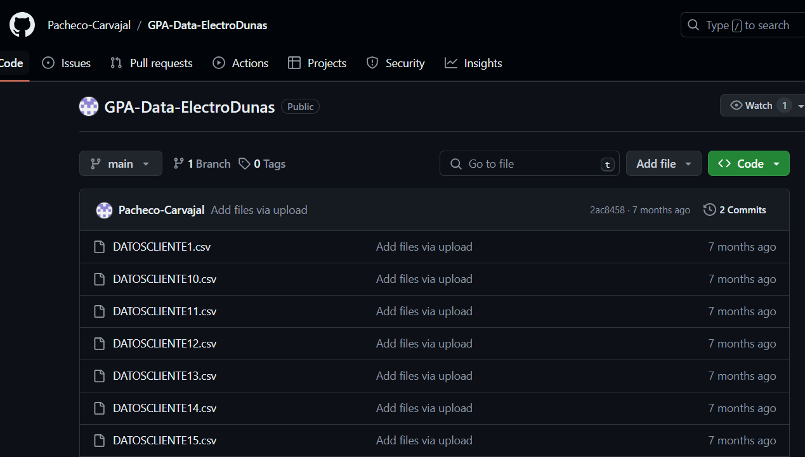
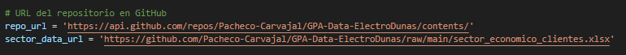
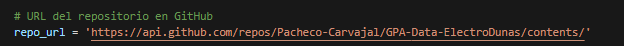
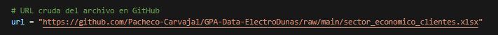
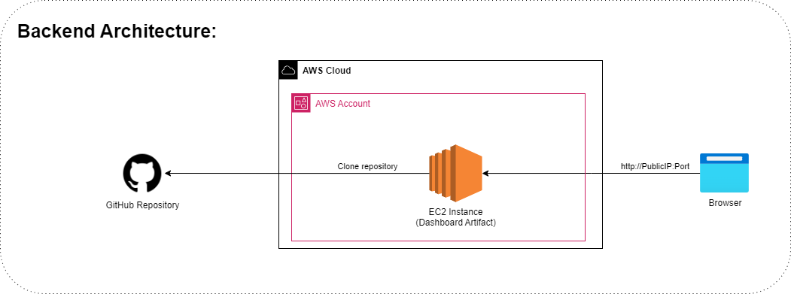

# Deteccion de Anomalás en clientes no regulados de ElectroDunas
### Contexto

ElectroDunas, subsidiaria del Grupo de Energía de Bogotá, se dedica a la distribución y comercialización de electricidad en Perú. Busca ser líder en su sector, proporcionando un servicio de alta calidad para impulsar el desarrollo regional. Atiende a más de 264,000 clientes en una zona de 7,108 km², incluyendo residenciales, empresas y entidades gubernamentales. Actualmente, se enfoca también en clientes no regulados con alta demanda, y busca apoyar sus estrategias organizacionales y visión a través de nuevos proyectos (como el que presentamos en este repositorio) que manejen eficientemente la información comercial y técnica aumentada.

### Planteamiento del problema
Una de las principales causas de pérdidas económicas en ElectroDunas es la presencia de pérdidas no técnicas de energía en clientes no regulados, las cuales no se identifican ni gestionan adecuadamente. Abordar efectivamente estas anomalías en los patrones de consumo es crucial para cumplir con su objetivo de liderazgo en el mercado y mantener altos niveles de calidad y excelencia en el servicio. Mejorando la detección y gestión de estas pérdidas, ElectroDunas no solo incrementará su rentabilidad y promoverá el desarrollo sostenible en sus regiones de influencia, sino que también asegurará un suministro de energía más confiable y eficiente, reflejando su compromiso con la excelencia y fortaleciendo su reputación entre colaboradores y clientes.

### Objetivo del proyecto y del actual repositorio
Implementar un sistema de detección de anomalías basado en datos históricos de clientes no regulados de ElectroDunas, que permita identificar anomalías que deberán ser gestionadas
para mejorar la eficiencia energética, reducir las pérdidas técnicas, y mejorar los indicadores financieros de la compañia.

# Manual de Usuario

### Link a este repositorio (en caso de exportar está guía) y Link a la herramienta previamente desplegada en AWS
* [**Repositorio**](https://github.com/dhoyoso/proyecto_grado_MIAD_ElectroDunas)
* [**Herramienta desplegada en AWS (para su uso y evaluación)**](http://ec2-3-208-19-151.compute-1.amazonaws.com:8000/)

### Solución, usuarios y usos

Esta solución está dirigida al equipo operativo de ElectroDunas quienes día a día son responsables de evaluar los consumos energéticos de sus clientes no regulados en Perú, estos se verán beneficiados por el tablero que proporciona datos sobre el consumo de energía facilitando la visualización de datos históricos además de realizar el pronóstico de la demanda y la detección de anomalías permitiendoles realizar un seguimiento más eficiente de los patrones de consumo, mejorar la gestión de recursos y abordar de manera más efectiva los problemas operativos del consumo de energía.

La identificación y reporte de anomalías cuenta con alertas visuales en caso de desviaciones significativas (que técnicamente ocurren si hay una alta recurrencia de datos anomalos en el periodo de pronóstico).

El tablero dinámico permite al usuario interactuar y comprender fácilmente la información histórica de los consumos energéticos de clientes no regulados con filtros integrados, se pueden seleccionar periodos de tiempo, clientes y sectores. Además, emplea 3 tipos de gráficos para ofrecer una representación visual de los consumos energéticos y las pérdidas no técnicas no confirmadas en función del tiempo, los clientes y sus respectivos sectores.


### Funcionalidades
* **Filtros:** El tablero dinámico permite al usuario interactuar y comprender fácilmente la información histórica de los consumos energéticos de clientes no regulados con filtros integrados, se pueden seleccionar periodos de tiempo (que van desde y hasta las fechas en las que se cuentan con datos), clientes y sectores.
* **Visualizaciones del Consumo de Energía:** El panel emplea 3 tipos de gráficos para ofrecer una representación visual de los consumos energéticos. El primero muestra un comparativo del total de consumo de energía activa por clientes de uno o todos los sectores en el periodo seleccionado, el segundo muestra el total de voltaje FA y FC de función del tiempo seleccionado y el tercero muestra el consumo de energía activa del cliente que se encuentre seleccionado, en todos los casos, teniendo cómo máximo la máxima fecha de datos con los que se cuenta en [el repositorio que contiene los datos de **origen** de este proyecto](https://github.com/Pacheco-Carvajal/GPA-Data-ElectroDunas).
* **Identificación de Anomalías y Proyecciones:** En el tercer gráfico descrito también se ofrece la capacidad de identificar patrones de consumo anormales (que se salgan de los límites que estipula el pronóstico) y proporciona proyecciones del consumo basadas en datos históricos.
* **Alertas ante desviaciones (anomalías) significativas:** Si el total de datos anomalos en el periodo de tiempo del pronóstico tiene una alta recurrencia o incidencia se genera una alerta visual roja y grande en la esquina inferior izquierda del tablero.
* **Métricas del pronóstico, total de consumo de energía activa, cantidad de datos anomalos y franja horaria con mayor consumo:** El tablero también cuenta con métricas del pronóstico como el MAPE del modelo de pronóstico del cliente, la franja horaria con mayor consumo del cliente y/o sector seleccionado, el total de consumo de energía activa en kWh y la suma del total de datos anomalos del cliente seleccionado en el último 5% de los datos.
* **Otras consideraciones (limitantes u oportunidades de mejora):** Se considera que como evolución el tablero podría generar alertas más dinámicas y que no dependan de seleccionar un cliente sino que diariamente se ejecute y envíe alertas a un correo electrónico. También podría tener más gráficos y mejorar su aspecto visual. Finalmente, se requiere retroalimentación del tablero en operación y de si las alertas reportadas realmente fueron consumos anomalos veríficados para detectar y priorizar oportunidades de mejora.

### Casos de uso que soporta el artefacto
* **Monitoreo y Análisis de Consumo:** Permite visualizar y analizar el consumo energético histórico por cliente, periodo o sector.
* **Detección de Anomalías en Tiempo Real:** Identifica desviaciones significativas en los patrones de consumo, alertando a los operadores para gestionarlas.
* **Optimización Operativa:** Facilita la planificación y operación basada en análisis de consumo y detección de patrones.
* **Gestión de Alertas:** Genera alertas visuales ante anomalías significativas para una respuesta rápida y eficaz.
* **Evaluación y Mejora de la Red:** Contribuye a la evaluación de la eficiencia de la red y a la mejora continua de las operaciones y estrategias.

## Funcionamiento

### Pre requisitos
* Para descargar, instalar, desplegar o actualizar esta herramienta en tu computadora (localmente) vas a requerir de herramientas cómo git y python.
* Si lo vas a desplegar en la nube de AWS requerirás git y una cuenta de [Amazon Web Services](https://console.aws.amazon.com/console/home).

### Despliegue local
1. Abre una terminal o CMD y clona el repositorio en la carpeta de tu preferencia.
```bash
git clone https://github.com/dhoyoso/proyecto_grado_MIAD_ElectroDunas
```
2. Ingresa a la carpeta del repositorio y dentro de el a la carpeta "dashboard".
```bash
cd proyecto_grado_MIAD_ElectroDunas/dashboard
```
3. Instala las dependencias con pip.
```bash
pip install -r requirements.txt
```
4. Corre el programa usando python.
```bash
python app.py
```
5. Valida su correcto funcionamiento en un navegador entrando a la url http://localhost:8050/.

6. Si deseas parar el tablero puedes cerrar la terminal o CMD u oprimir ctrl + c (en windows).

### Despliegue en nube

Creación y parametrización de instancia EC2:

1. Ingresa a tu cuenta a tu cuenta de [Amazon Web Services](https://console.aws.amazon.com/console/home).
2. Una vez estés en la consola busca "ec2" en la barra de búsqueda y selecciona la opción que te aparece.
3. Da click en "Instances" o "Instancias".

4. Luego, da click en "Launch Instance" o "Lanzar Instancia".

5. Configura el nombre e imagen (sistema operativo) de la instancia cómo se muestra en la imágen.

6. Selecciona el tipo de instancia como se muestra en la imagen (si quieres mayor desempeño y menor tiempo de respuesta elige una máquina con más recursos) y crea y descarga un par de llaves .pem para acceder a tu instancia de manera segura así:


7. Revisa el resumen de tu instancia que sea similar a este a excepción del tipo de instancia si lo cambiaste.

8. Si todo está correcto saldrá este mensaje.

9. Regresa a la consola de EC2 y da click en el id de la instancia

10. Ve a los grupos de seguridad (click en security)

11. Abre el security group que sale en el inbound rule (click en launch-wizard)

12. Seleccionalo nuevamente en la consola de security groups

13. Da click en edit inbound rule

14. Edita el inbound rule como se muestra en la imagen y guarda.


Despliegue:

1. Abre un windows powershell cómo administrador.
2. Clona el repositorio.
```bash
git clone https://github.com/dhoyoso/proyecto_grado_MIAD_ElectroDunas
```
3. Ingresa a la carpeta del repositorio en powershell
```bash
cd proyecto_grado_MIAD_ElectroDunas
```
4. Modifica los parámetros del archivo "ec2_deploy.ps1" poniendo la url a tu instancia ec2 y la ruta al archivo .pem para el acceso.

5. En powershell ejecuta el archivo ec2_deploy.ps1

6. Puedes cerrar el powershell si lo deseas y ve a un navegador, pon la url pública de tu instancia ec2 seguido del puerto 8000 y el tablero cargará cómo se muestra en la imágen.


### Actualización o cargue de nuevos datos

Para actualizar o cargar nuevos datos, es necesario que estos datos sean cargados en [el repositorio que contiene los datos de origen de este proyecto](https://github.com/Pacheco-Carvajal/GPA-Data-ElectroDunas). 

De lo contrario, será necesario crear un repositorio con esa misma estructura y poner los nuevos datos en dicha estructura, además de reemplazar en los archivos [load_and_preprocess_data.py](./load_and_preprocess_data.py) y [load_train_predict_LSTM_XGB.ipynb](./load_train_predict_LSTM_XGB.ipynb) la url del repositorio de origen puesto que el primero descarga y preprocesa los datos para los gráficos históricos dejando su resultado en el archivo [dashboard/data/preprocessed.csv](./dashboard/data/preprocessed.csv) y el segundo descarga, entrena los modelos LSTM y XGB y cálcula el pronóstico y umbrales de cada cliente y los almacena en archivos csv individuales por cliente en la carpeta [dashboard/data](./dashboard/data).

Urls a actualizar en script:



Urls a actualizar en Notebook:




Dado lo anterior, para acabar de **actualizar los datos en el tablero** tras actualizarlos en el repositorio de origen mencionado anteriormente, es necesario **correr el notebook y script de python** mencionados a cabalidad para actualizar los insumos del tablero en la carpeta data y finalmente, **proceder con el re despliegue** que se puede realizar tal cuál como se menciona en las secciones de despliegue.

### Uso del artefacto

Para usar el artefacto, es necesario en primera instancia interactuar con los filtros, y específicamente para ver el diagrama de la serie de tiempo de energía activa, con su pronóstico, umbrales y actualizar los totales de anomalías y ver la métrica MAPE es necesario seleccionar un cliente en el filtro respectivo. 

Adicionalmente, con los demás filtros se pueden manipular las otras gráficas para filtrar por una rango de fechas y horas específicas, cliente y/o sector.

# Anexo técnico

### Diagrama esquemático propuesto (prototipo vs real y arquitectura)

Prototipo:

Real:

Arquitectura:


### Reporte técnico de experimentos
[Consulta el reporte técnico de experimentos aquí](./anexos/Reporte%20de%20selección%20y%20parametrización%20de%20modelos.pdf)

### Archivos de código desarrollados para el prototipo
Todos los archivos de código del prototipo se encuentran en [este repositorio](https://github.com/dhoyoso/proyecto_grado_MIAD_ElectroDunas).

Y se describen a continuación:
```
📦 proyecto_grado_MIAD_ElectroDunas
 ┣ 📄 load_train_predict_LSTM_XGB.ipynb --> Notebook para cargar datos del repo origen, entrenar modelos LSTM y XGB para cada cliente, genera los pronósticos y guarda un csv por cada cliente en la carpeta data del dashboard.
 ┣ 📄 load_and_preprocess_data.py --> Script para cargar datos del repo origen, pre procesarlos y ponerlos en la carpeta data para las visualizaciones históricas.
 ┣ 📄 exploratory_data_analysis.ipynb --> Notebook con el Análisis exploratorio de datos realizado.
 ┣ 📄 ec2_deploy.ps1 --> PowerShell script para conectarse a la máquina, instalar dependencias, clonar repo y desplegar tablero en aws ec2.
 ┣ 📄 best_models.xlsx --> Archivo xslx con los mejores modelos por cada cliente (modelo, hiperparametros, etc.).
 ┣ 📄 best_3_models.xlsx --> Archivo xslx con los mejores 3 modelos por cada cliente (modelo, hiperparametros, etc.).
 ┣ 📄 README.md --> Documento con el manual de usuario, manual de despliegue, anexos técnicos y todos los requisitos del entregable.
 ┣ 📄 .gitignore --> Archivo .gitignore para ignorar archivos y extensiones en el versionamiento.
 ┣ 📂 anexos --> Carpeta con los archivos anexos como el reporte de selección de modelos.
 ┣ 📂 evidencias_requisitos --> Evidencias de los requisitos del prototipo o tabla de requisitos.
 ┣ 📂 images --> Imágenes utilizadas en esta guía.
 ┣ 📂 models_calibration --> Carpeta con los notebooks y resultados de la calibración de modelos.
 ┃ ┣ 📂 results --> Carpeta los archivos resultantes de la iteración de modelos (se tiene en cada excel los modelos, sus parametros y sus métricas).
 ┃ ┗ 📄 model_selection_and_calibration_N --> Notebooks con diferentes experimentos de selección y calibración de modelos.
 ┣ 📂 dashboard --> Carpeta con el prototipo principal, tablero o dashboard de la solución.
 ┃ ┣ 📂 assets --> Carpeta con los archivos .css que le dan estilo al tablero o dashboard.
 ┃ ┃ ┣ 📄 base.css --> Archivo css con el estilo del tablero.
 ┃ ┃ ┗ 📄 clinical-analytics.css --> Archivo css con el estilo del tablero.
 ┃ ┣ 📂 data --> Carpeta con los datos de los clientes preprocesados para el histórico y los archivos de los clientes individuales con pronóstico y umbrales para el gráfico de serie de tiempo.
 ┃ ┣ 📄 app.py --> Archivo principal con la lógica y elementos del talbero en Dash.
 ┃ ┗ 📄 requirements.txt --> Archivo de requerimientos o dependencias de python necesarias para correr el tablero.
```

### Rúbrica de evaluación diligenciada
PDTE NO SE A QUÉ SE REFIERE.

# Rúbrica de pruebas diligenciada como resultado de validación del prototipo
PDTE POR IMPLEMENTAR.

# Video - Pitch
PDTE POR IMPLEMENTAR.